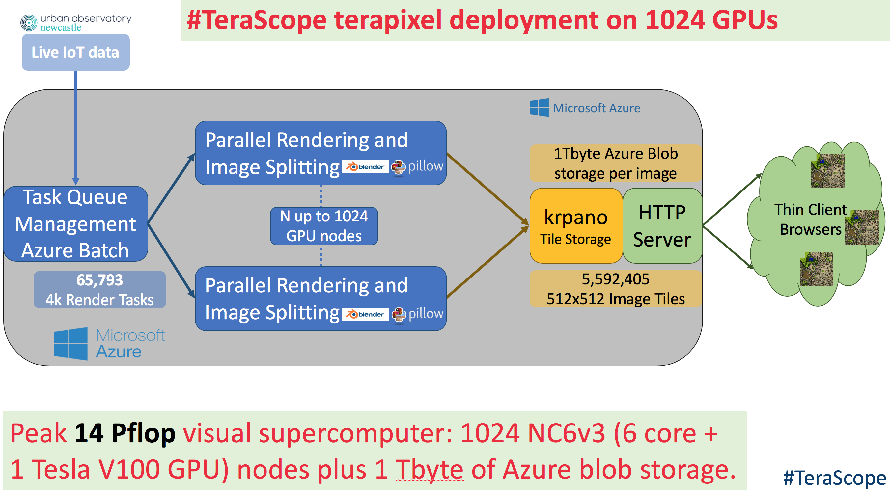
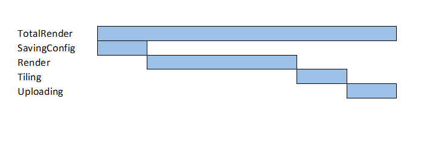

# Performance evaluation of Terapixel rendering in Cloud (Super)computing

## Contents

1. [Background](#background)
1. [Problem Description](#problem-description)
1. [Contacts](#contacts)
1. [Dataset](#data-outline)
    1. Overview
    1. [Schema: application-checkpoints.csv](#application-checkpointscsv-1112mb)
    1. [Schema: gpu.csv](#gpucsv-2087mb)
    1. [Schema: task-x-y.csv](#task-x-ycsv-62mb)

## Background
Terapixel images offer an intuitive, accessible way to present information sets to stakeholders, allowing viewers to interactively browse big data across multiple scales. The challenge we addressed here is how to deliver the supercomputer scale resources needed to compute a [realistic terapixel visualization of the city of Newcastle upon Tyne](http://terapixel.wasabi.1024.s3.eu-central-1.wasabisys.com/vtour/index.html) and its environmental data as captured by the Newcastle Urban Observatory. 

Our solution is a scalable architecture for cloud-based visualization that we can deploy and pay for only as needed. The three key objectives of this work are to: create a supercomputer architecture for scalable visualization using the public cloud; produce a terapixel 3D city visualization supporting daily updates; undertake a rigorous evaluation of cloud supercomputing for compute intensive visualization applications. 

We demonstrate that it is feasible to produce a high quality terapixel visualization using a path tracing renderer in under a day using public IaaS cloud GPU nodes. Once generated the terapixel image supports interactive browsing of the city and its data at a range of sensing scales from the whole city to a single desk in a room, accessible across a wide range of thin client devices.

## Problem Description
The dataset below was created from application checkpoint and system metric output from the production of a terapixel image. There are a variety of problems which can be addressed using the TeraScope dataset. Each will commence with an exploratory data analysis. Examples of questions you may wish to be able to answer through the EDA process are as follows:

- Which event types dominate task runtimes?
- What is the interplay between GPU temperature and performance?
- What is the interplay between increased power draw and render time?
    - Can we quantify the variation in computation requirements for particular tiles?
- Can we identify particular GPU cards (based on their serial numbers) whose performance differs to other cards? (i.e. perpetually slow cards). 
- What can we learn about the efficiency of the task scheduling process?

A project may focus entirely on the EDA process, or you may also wish to develop a data product to allow interactive exploration of the data. For example, you could develop a [Shiny dashboard](https://shiny.rstudio.com/tutorial/) to display the results of your analysis into render performance and system operation, displaying timelines of execution based on the application checkpoint data.

### Data Outline

The dataset described below was created during a run using 1024 GPU nodes. This run is split into 3 jobs to render; levels 4, 8 and 12 of the [visualisation output](http://terapixel.wasabi.1024.s3.eu-central-1.wasabisys.com/vtour/index.html).

The data provided shows performance timing of the render application, performance of the GPU card, and details of which part of the image was being rendered in each task.

The data files are accessible [here](https://newcastle-my.sharepoint.com/:f:/g/personal/nmf47_newcastle_ac_uk/EokX5ELIaCBGnhekrtX-7CwBFNpY8tgmQAcLuLclYMX-RA?e=aEKUih).

## application-checkpoints.csv (111.2MB)

This file contains application checkpoint events throughout the execution of the render job. Examples of the events are given for the `eventName` field.

### Schema

#### timestamp

Example:
```
"2018-11-08T07:41:55.921Z"
```

#### hostname

Hostname of the virtual machine auto-assigned by the Azure batch system.

Example:
```
"0d56a730076643d585f77e00d2d8521a00000N"
```

#### eventName

Name of the event occuring within the rendering application.

- **TotalRender** is the entire task
- **Render** is when the image tile is is being rendered
- **Saving Config** is simply a measure of configuration overhead
- **Tiling** is where post processing of the rendered tile is taking place
- **Uploading** is where the output from post processing is uploaded to Azure Blob Storage

Possible Values:
```
"Tiling"
"Saving Config"
"Render"
"TotalRender"
"Uploading"
```



#### eventType

Possible Values:
```
"START"
"STOP"
```

#### jobId

ID of the Azure batch job.

Example:
```
"1024-lvl12-7e026be3-5fd0-48ee-b7d1-abd61f747705"
```

#### taskId

ID of the Azure batch task.

Example:
```
"b47f0263-ba1c-48a7-8d29-4bf021b72043"
```

---

## gpu.csv (208.7MB)

This file contains metrics that were output regarding the status of the GPU on the virtual machine.

## Schema

#### timestamp

Example:
```
"2018-11-08T08:27:10.314Z"
```
#### hostname

Hostname of the virtual machine auto-assigned by the Azure batch system.

Example:
```
"8b6a0eebc87b4cb2b0539e81075191b900001C"
```

#### gpuSerial

The serial number of the physical GPU card.

Example:
```
"0323217055910"
```

#### gpuUUID

The unique system id assigned by the Azure system to the GPU unit.

Example:
```
"GPU-1d1602dc-f615-a7c7-ab53-fb4a7a479534"
```

#### powerDrawWatt

Power draw of the GPU in watts.

Example:
```
131.55
```

#### gpuTempC

Temperature of the GPU in Celsius

Example:
```
48
```

#### gpuUtilPerc

Percent utilisation of the GPU Core(s).

Example:
```
92
```

#### gpuMemUtilPerc

Percent utilisation of the GPU memory.

Example:
```
53
```

---

## task-x-y.csv (6.2MB)

https://newcastle-my.sharepoint.com/:x:/g/personal/nmf47_newcastle_ac_uk/EcQ19ys-zChNsDYzwcnjeO4Bdt4sRz-PsGsDuoCAkhG3Ig?e=SKdTNM

This file contains the x,y co-ordinates of which part the image was being rendered for each task.

### Schema

#### jobId

Id of the Azure batch job.

Example:
```
"1024-lvl12-7e026be3-5fd0-48ee-b7d1-abd61f747705"
```

#### taskId

ID of the Azure batch task.

Example:
```
"b47f0263-ba1c-48a7-8d29-4bf021b72043"
```

#### x

X co-ordinate of the image tile being rendered.

Example:
```
116
```

#### y

Y co-ordinate of the image tile being rendered.

Example:
```
178
```

#### level

The visualisation created is a zoomable "google maps style" map. In total we create 12 levels. Level 1 is zoomed right out and level 12 is zoomed right in. You will only see levels 4, 8 and 12 in the data as the intermediate level are derived in the tiling process.

Example:
```
12
```


---

## Contacts

If you have any questions regarding the data please include the following in the **To:** line and clearly state **CSC8634** in the subject line so we prioritise picking up your query.

Matthew Forshaw
<matthew.forshaw@newcastle.ac.uk>
